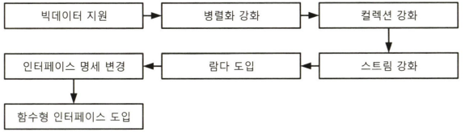
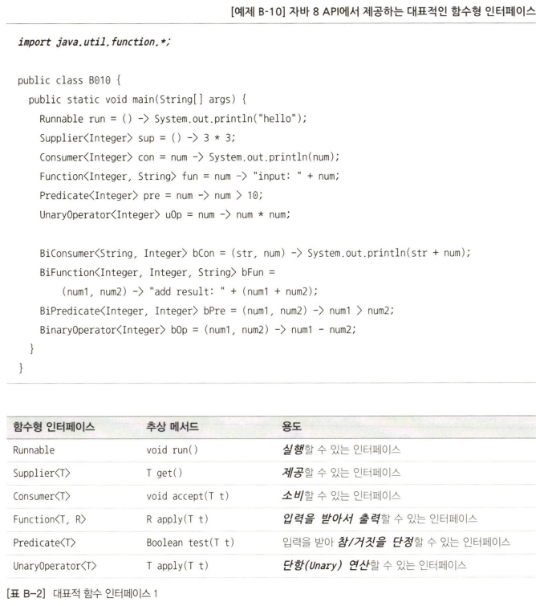

# 부록B 자바8 람다와 인터페이스 스펙 변화

## 📝 정리

### 1. 람다가 도입된 이유

- **람다를 지원하기 위한 인터페이스를 함수형 인터페이스라고 한다.**

### 2. 람다란 무엇인가?

- 람다란 한 마디로 **코드 블럭**이다.
- 기존의 코드 블럭은 반드시 메서드 내에 존재해야만 했다.
- **람다를 통해 코드 블럭을 변수처럼 사용할 수 있다.**
<pre>Runnable r = () -> System.out.println("Hello Lambda!");
</pre>

### 3. 함수형 인터페이스

- 추상 메서드 **하나**만 갖는 인터페이스
- 함수형 인터페이스만을 람다식으로 변경할 수 있다.

- 타입 추정 : 파라미터 자료형 생략 가능
- 파라미터가 하나이면 소괄호 생략 가능
- 코드가 한 줄인 경우 중괄호 생략 가능
  - 다만, return구문과 연산식 뒤 세미콜론도 없애야함
  
<pre>ExampleInterface ei = a -> a * a;

interface ExampleInterface{
    int runSomething(int count);
}
</pre>

### 4. 메서드 호출 인자로 람다 사용

- 람다식을 메서드의 인자로도 사용할 수 있다.
- = 코드블럭을 메서드의 인자로 전달할 수 있다.

<pre>doIt( a -> a * a );</pre>

### 5. 메서드 반환값으로 람다 사용

<pre>ExampleInterface ei = todo();
...
public static ExampleInterface todo(){
    return num -> num * num;
}
</pre>

### 6. 자바8 API에서 제공하는 함수형 인터페이스

- java.util.function 패키지 등에서 많이 쓰일 것으로 예상되는 함수형 인터페이스를 이미 만들어둠.

### 7. 컬렉션 스트림에서 람다 사용

- 아래 두 코드는 같은 기능을 한다.
<pre>for ( int age : ages ) {
    if ( age < 20 ) {
        System.out.format("Age %d! Can't enter", age);
    }
}

Arrays.stream(ages)
    .filter( age -> age < 20 )
    .forEach( age -> System.out.format("Age %d! Can't enter", age));
</pre>

- filter 인자 : 함수형 인터페이스 Predicate
- forEach 인자 : 함수형 인터페이스 Customer

### 8. 메서드 레퍼런스와 생성자 레퍼런스

- 람다식의 인자를 아무런 가공없이 사용/출력하는 코드를 사용할 때 **메서드 레퍼런스**라는 형식을 쓸 수 있다.
- 결국 메서드 레퍼런스는 **람다식으로 변형**되고 최종적으로 함수형 인터페이스가 된다.

- 메서드 레퍼런스
  - 인스턴스::인스턴스메서드
    - 람다식의 인자는 인스턴스 메서드의 인자가 된다.
    - <pre>sqrtNum -> System.out.println(sqrtNum)             System.out::println</pre> 
  - 클래스::정적메서드
    - 람다식의 인자는 정적 메서드의 인자가 된다.
    - <pre>num -> Math.sqrt(num)                                Math::sqrt</pre>
  - 클래스::인스턴스메서드
    - 람다식의 첫 번째 인자는 인스턴스가 되고, 그 다음 인자(들)은 메서드의 인자(들)가 된다. 
    - <pre>(a,b) -> a.compareTo(b)                              Integer::compareTo</pre>

### 9. 인터페이스의 디폴트 메서드와 정적 메서드

- 인터페이스가 가질 수 있는 멤버
  - 정적 상수 (기존)
  - 추상 인스턴스 메서드 (기존)
  - 구체 인스턴스 메서드 **(추가)**
  - (구체) 정적 메서드 **(추가)**

- 구체 : 구체화. 몸체를 가진 메서드

### 10. 정리

> 람다 = 변수에 저장 가능한 로직

- 람다는 지역 변수, 속성, 메서드의 인자, 메서드의 반환값으로 사용 가능하다.
- 람다를 통해 더 이상 로직을 기존의 메서드의 체계 안에 구현하지 않아도 된다.
